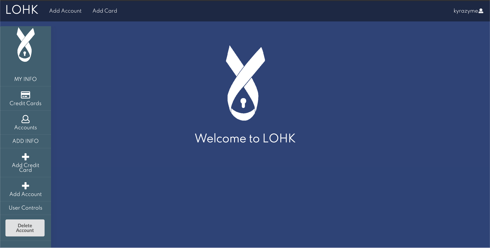
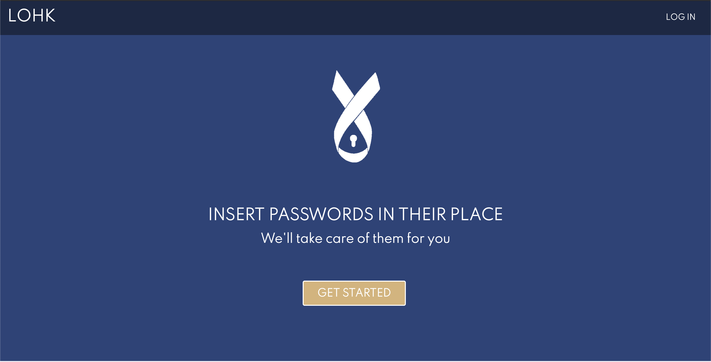
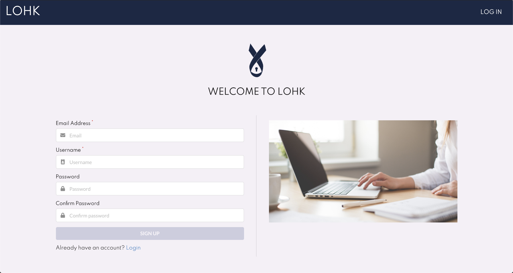
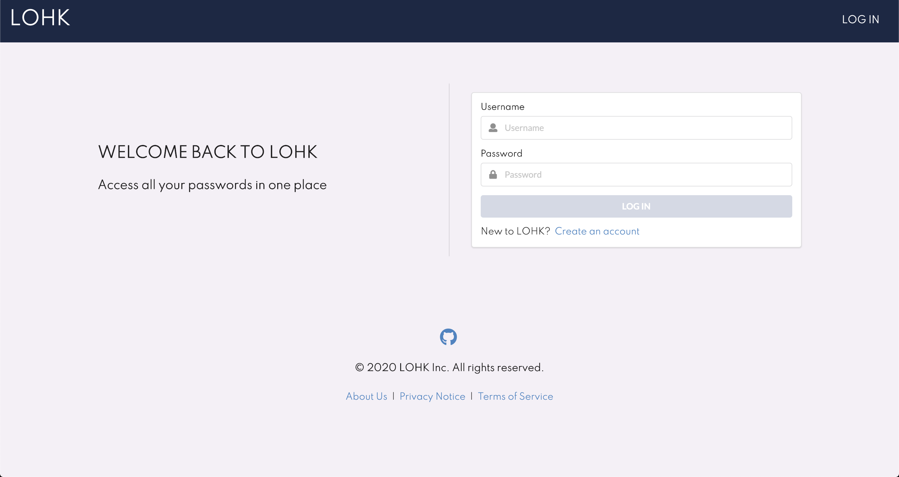
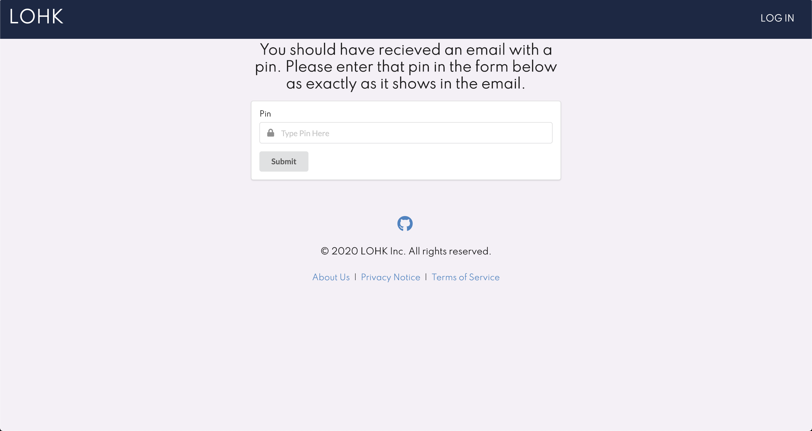
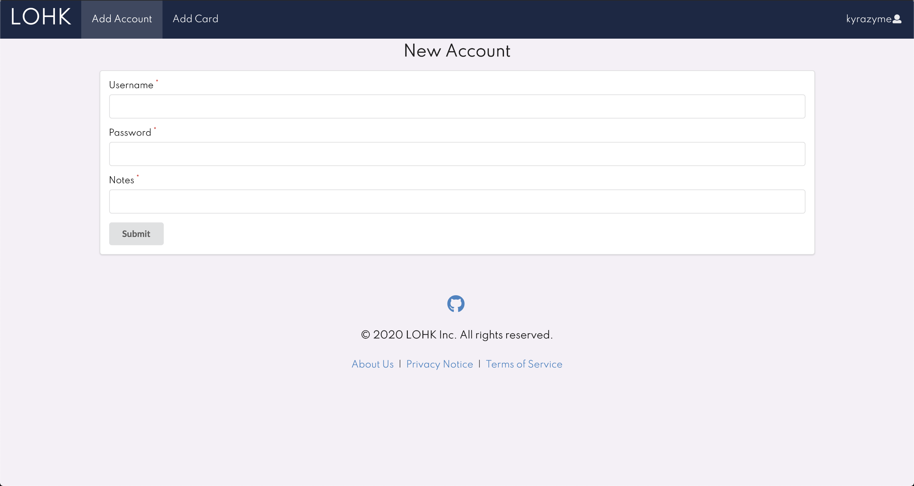
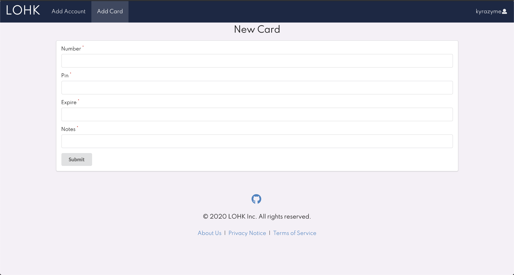

## Table of Contents
* [Home](#home)
* [Contact Us](#contact-us)
* [User Guide](#user-guide)

## Home

LOHK is a web application utilizing semantic ui, react.js, meteor, and mongoDB to create a password manager for anybody to use. However, LOHK is not just exclusively for passwords. Credit cards and debit cards can also be stored with card number, security pin, and expiration date. All users have to do is select the "Add Credit Card" or "Add Account" options on the main page and it will redirect them to a form to fill out the information. 

For more information on the techstack used:
* [Meteor](https://www.meteor.com/) for Javascript-based implementation of client and server code. 
* [React](https://reactjs.org/) for component-based UI implementation and routing.
* [Semantic UI React](https://react.semantic-ui.com/) CSS Framework for UI design.
* [MongoDB](https://www.mongodb.com/) Backend Database for adding objects

LOHK's central home page can be viewed below:

## Contact Us

LOHK's Development Team:

- Corben Broennimann - Front End
    - Email - corben@hawaii.edu
- Jake Camarao - Back End
    - Email - jcamarao@hawaii.edu
- Kyra Ikeda - Front End 
    - Email - kyrai@hawaii.edu
- James Lau - Back End
    - Email - jklau88@hawaii.edu

## User Guide

To navigate through LOHK, you will first be redirected to the landing page From here, you can either proceed to the sign-in page if you already are registered. If you are a new user, you can click the "GET STARTED" button to get redirected to the sign-up page.

If you are just signing-up for the first time, you will simply have to create an account and you will be redirected to the home page upon a successful creation. However, every session after that will require the pin.

If you already have an account and are signing-in as a reoccurring user, after logging in, you will be redirected to a page where you will get a pin sent to your registered email to access your account. This will occur every session to protect sensitive information.

Once you successfully sign-up or sign-in, you are now redirected to the home page. From here, you can click on the "Credit Cards" or the "Accounts" button to display the information that you wish to see. If you wish to add a new account or new card, you can click the "Add Account" or "Add Credit Card" in the side bar or the "Add Account" or "Add Card" in the topbar. 

You will then get redirected to either a page where you are asked to fill out information about the account or card that you wish to have saved. Once everything is filled out, you can just click submit and go back to the home page. It should now be displayed!

